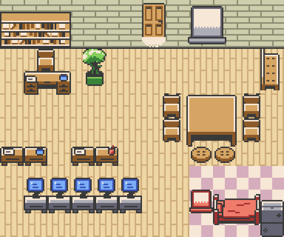

# office

A [Claude Code](https://claude.com/claude-code) mod that turns your sessions into a pixel-art office in the style of a Game Boy Color RPG. Every running Claude Code session is a character, and its room shows what it is doing: coding at a computer, reviewing at a desk, planning at the whiteboard, waiting for you in the meeting room, or idling on the couch.



## Features

- **Office scene.** One character per session (and per subagent of a conversation), animated at 10 fps: they walk in through the door, sit, type, think, hum music on the couch, and blink a "!" when they need you. Room follows state:

  | Session is | Goes to |
  | --- | --- |
  | coding (edits, commands) | a computer desk |
  | reviewing (reading) | the plain desk |
  | planning | the whiteboard (thought bubble) |
  | waiting for you | the meeting room (blinking "!") |
  | idle | the break room (music notes) |
  | managing | the manager's desk |

- **Session board.** A text list of your other sessions: see their status, message them, copy a resume command. It works in any terminal and in the desktop app.
- **Agent orchestration.**
  - *Manager role* (`/office manage`): one session becomes its project's manager. It splits the goal, routes and delegates tasks, and keeps a shared notebook (`post_note` / `read_notes`).
  - *Model router* (`/route-task`, `/route-eval`): picks a model tier (Haiku 5.5 for basic work, Sonnet 5.5 for medium, Opus 5.5 for high-level; Fable only when you name it) and effort for a task, using a rules backend, Claude, or an external router, and scores itself against labelled tasks: the public `mod/evals/routing.jsonl`, plus your own private labels, the log of routed tasks (`/route-inbox`) and `/route-eval` results in `~/.claude/office/evals/` (or `$CLAUDE_CONFIG_DIR/office/evals/`), shared by every copy of the plugin. Files an older version left in `mod/evals/` are copied there once.
  - *Workers* (`/spawn`): run a routed task as a background `claude --bg` worker. Workers show up in the office too. A **budget guard** blocks new workers when your rate-limit windows run high. Option `maxWorkers` (default 4) caps the jobs running at once; `maxOpusWorkers` caps the workers on Opus-tier models (opus, fable or their full ids) among them, refusing rather than downgrading a new one (default 0: no separate limit; Codex reviews don't count).
  - *Worktrees per worker*: a worker started in a git repo works on its own branch in its own git worktree under `~/.claude/office/worktrees/`, commits there, and its result reports the branch, commits and diffstat. A clean worktree is removed when it finishes and the branch stays for review (option `workerWorktree`: `auto` | `off`). The worker is told it is already on its branch and must never switch; `spawn_worker` takes `branch` to name that branch and `base` to start it from another commit (a branch that exists or is checked out elsewhere is refused).
  - *Worker watchdog*: a job still running after `jobTimeoutMin` (default 45; time blocked on approval not counted) gets one extension, to `jobTimeoutHardMin` (default 60), if its transcript grew in the last 5 minutes, and is ended otherwise. A worker ended for time has its uncommitted work committed on its branch as `WIP: timed out at N min (office)` (files over 5 MB left out, the repo's hooks run) and its worktree kept. A worker waiting on approval longer than `blockedTimeoutMin` (default 20) is reported to the manager, and ended the same way at twice that; one with no reply 5 minutes after it started is reported as stalled, with the hint to stop and re-spawn it.
  - *Codex handoff* (`/codex-review`): Codex reviews the repo in the background. A **Codex budget guard** reads Codex's 5-hour and weekly usage before each job (free: no message spent), warns from 80% and refuses at 95%, and after a quota hit refuses that model until Codex's reset time. Only a typed `/codex-review --force` overrides.
- **Manga reader** (`/manga`): reads chapters from `~/Manga/<Series>/` (folders of PNGs or `.cbz`) in a side pane while Claude works.

## Install

```sh
claude plugin marketplace add aatrey56/office
claude plugin install office@office
```

You need:

- a Claude Code build with mod (function-hook plugin) support (2.1.289 is known to work);
- macOS: the scene, the manga reader and the frame cache assume it;
- for the pixel office, a terminal that speaks the kitty graphics protocol: [Ghostty](https://ghostty.org), kitty, WezTerm or iTerm2. The desktop app shows the text board but not the pictures;
- optionally, the [Codex CLI](https://github.com/openai/codex) for `/codex-review` (`npm install -g @openai/codex`; the plugin finds it on PATH, or set its `codexPath`).

To work on the plugin, load it from a clone instead:

```sh
git clone https://github.com/aatrey56/office
claude --plugin-dir /path/to/office/mod
# or, for every session:
export CLAUDE_CODE_PLUGIN_DIRS=/path/to/office/mod
```

## Commands and keys

| Command | What it does |
| --- | --- |
| `/office` | Open the board / office pane (`/office band` draws it above the prompt instead) |
| `/office manage`, `/office manage off` | Make this session its project's manager, or stop |
| `/spawn <task>` | Route a task and run it as a background worker |
| `/route-task <task>` | Dry run: which model and effort the router would pick |
| `/route-eval [rules\|claude\|jev\|all]` | Score the router against `evals/routing.jsonl` and your `~/.claude/office/evals/routing.local.jsonl` |
| `/route-inbox` | Routed tasks not yet labelled in `routing.local.jsonl` |
| `/codex-review [--deep] [--model m] [--force]` | Background Codex review of the repo |
| `/jobs` | The jobs pane: workers and reviews |
| `/manga [series]` | Open the manga reader |

| Pane | Keys |
| --- | --- |
| Board | `j`/`k` move, `m` message, `c` copy resume command, `r` refresh, `t` office view, `b` manga |
| Office | `h`/`l` previous/next project's office, `m` message, `u`/`n` older/newer chat, `t` text board, `b` manga, `d` debug |
| Jobs | `k` kill, `a` copy attach command, `c` copy output |
| Manga | `j`/`k` page, `h`/`l` chapter, `o` office, `Esc` close |

## How it works

- **Two folders.** `mod/` is the plugin itself. `art/` is a Bun tool that turns the source tilesheets and sprites into `mod/hooks/scene/art-data.ts`.
- **Pure core, thin shell.** Logic lives in pure modules (`mod/hooks/*.ts`, `mod/hooks/scene/*.ts`): session to character (`model.ts`), pathfinding and walking (`motion.ts`), painting (`paint.ts`), and PNG encoding (`encode.ts`). The `.tsx` hook files make every `$` engine call and stay thin. The engine never lets `$` cross an import, so the core is testable without it.
- **Sorted painter's drawing.** Each frame paints the floor tiles, then props and characters sorted by their base row, so a desk in front covers its sitter and a couch draws under the person on it. Bubbles go on top.
- **Frames through files.** Each painted frame is encoded as an indexed PNG and written to a small cache file. The pane swaps the image source instead of pushing pixels through the transcript. A still room is sent at half rate, and an empty one not at all.

The GIF above is made by the same code: `art/tools/demo.ts` scripts a few sessions and calls `deriveCrew`, `assignSeats`, `stepActors` and `paintFrame` frame by frame.

## Art pipeline

```sh
cd art && bun install
bun tools/export.ts --debug   # writes mod/hooks/scene/art-data.ts, art/out/debug.png, art/out/preview.png
bun tools/demo.ts             # rebuilds docs/office-demo.gif (needs ffmpeg)
```

The source art is not in the repo. Download the two packs listed under [Credits](#credits) into `art/raw/` first: the export reads `art/raw/character_base_16x16.png` (zaphgames) and `art/raw/monkeyimage-interior/2367228` (the MonkeyImage tilesheet PNG, kept under its itch.io file id).

## Credits

- Furniture, floors and walls: [Home Interior Tilesheet (Game Boy styled)](https://monkeyimage.itch.io/home-interior-tilesheet-gameboy-styled) by MonkeyImage. Free download; no formal license on the page. Used with credit.
- Characters: [Simple Character Base 16x16](https://opengameart.org/content/simple-character-base-16x16) by zaphgames, CC0.

Both were recoloured into original palettes. Code is MIT.
